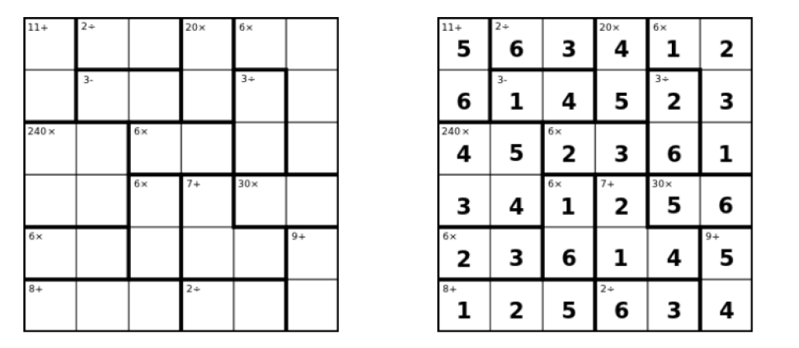

# KenKen-Solver

[**KenKen**](https://en.wikipedia.org/wiki/KenKen) is an arithmetic and logic puzzle . It is a **Constraint Satisfaction Problem** ***(CSP)***, that the particular program solves using algorithms like ***BT, BT+MRV, FC, FC+MRV and MAC*** provided by [aima-code](https://github.com/aimacode/aima-python).


### Table of Contents

[Puzzle representation](#puzzle_repr)

[Inputs](#inputs)

[Algorithms](#algorithms)

[Prerequisites](#prerequisites)


[How to run](#run)


<a name="puzzle_repr"/>

## Puzzle representation

### Board



The *KenKen* board is represented by a square *n-by-n* grid of cells. The grid may contain between 1 and n boxes *(cages)* represented by a heavily outlined perimeter. Each cage will contain in superscript: the target digit value for the cage followed by a mathematical operator.

### Constraints

Each valid solution must follow the below rules:

- The only numbers you may write are 1 to N for a *NxN* size puzzle.
- A number cannot be repeated within the same row.
- A number cannot be repeated within the same column.
- In a one-cell cage, just write the target number in that cell.
- Each "cage" *(region bounded by a heavy border)* contains a "target number" and an arithmetic operation. You must fill that cage with numbers that produce the target number, using only the specified arithmetic operation. Numbers may be repeated within a cage, if necessary, as long as they do not repeat within a single row or column.


<a name="inputs"/>

## Inputs 

There are some demo input *KenKen* files, of increasing complexity and difficulty, provided in the [inputs](./inputs) folder.

If you would like to use your own, you should place them in the [inputs](./inputs) folder, as well.

> The input's file format, used to describe a puzzle is:

```
<puzzle_size>
[Square_indexes1] Cage_operator1 Cage_target1
[Square_indexes2] Cage_operator2 Cage_target2
[Square_indexes3] Cage_operator3 Cage_target3
...
[Square_indexesM] Cage_operatorM Cage_targetM
```

> For example, the text representing the above puzzle is:

```
6
[(0,0),(1,0)] add 11
[(0,1),(0,2)] div 2
[(0,3),(1,3)] mult 20
[(0,4),(0,5),(1,5),(2,5)] mult 6
[(1,1),(1,2)] sub 3
[(1,4),(2,4)] div 3
[(2,0),(2,1),(3,0),(3,1)] mult 240
[(2,2),(2,3)] mult 6
[(3,2),(4,2)] mult 6
[(3,3),(4,3),(4,4)] add 7
[(3,4),(3,5)] mult 30
[(4,0),(4,1)] mult 6
[(4,5),(5,5)] add 9
[(5,0),(5,1),(5,2)] add 8
[(5,3),(5,4)] div 2
```


<a name="algorithms"/>

## Algorithms

You can select among 5 algorithms to solve a puzzle:

- **Backtracking** *(command line parameter **"BT"**)*.
- **Backtracking with Minimum Remaining Values** *(command line parameter **"BT+MRV"**)*.
- **Forward Checking** *(command line parameter **"FC"**)*.
- **Forward Checking with Minimum Remaining Values** *(command line parameter **"FC+MRV"**)*.
- **Maintaining Arc Consistency** *(command line parameter **"MAC"**)*.

### Comparison

The table below represents the number of assignments used from each algorithm, to solve different size puzzles:

|  Size  |   BT   | BT+MRV |   FC   | FC+MRV |   MAC  | 
| :----: | :----: | :----: | :----: | :----: | :----: |
| **3x3**|   10   |   10   |   9    |   10   |   9    |
| **4x4**|   33   |   24   |   31   |   83   |   18   |  
| **5x5**|   89   |*FWerr*  |   42   |   98   |   26   |  
| **6x6**|   947  |*FWerr* |   48   |   263  |   74   |  
| **7x7**|  2600  |*FWerr* |   281  |   1020 |   66   |

<br/>

The table below represents the time that each algorithm needed, to solve different size puzzles:

|  Size  |   BT   | BT+MRV |   FC    | FC+MRV |   MAC  | 
| :----: | :----: | :----: | :-----: | :----: | :----: |
| **3x3**|0.001619|0.002258|0.001833 |0.002329|0.003514|
| **4x4**|0.018993|0.040852|0.009197 |0.015933|0.018328|  
| **5x5**|0.033648|*FWerr* |0.020142|0.064241|0.065805|  
| **6x6**|0.533216|*FWerr* |0.037589|0.434889|0.286044|  
| **7x7**|1.939305|*FWerr* |0.236317|13.71082|0.844914|  

> *FWerr*: AIMA-CSP framework error


<a name="prerequisites"/>

## Prerequisites

- [python](https://www.python.org/downloads/) *(version >= 3.6)*
- [numpy](https://numpy.org/)


<a name="run"/>

## How to run

```
$ python kenken.py [input_file] [algorithm]
```